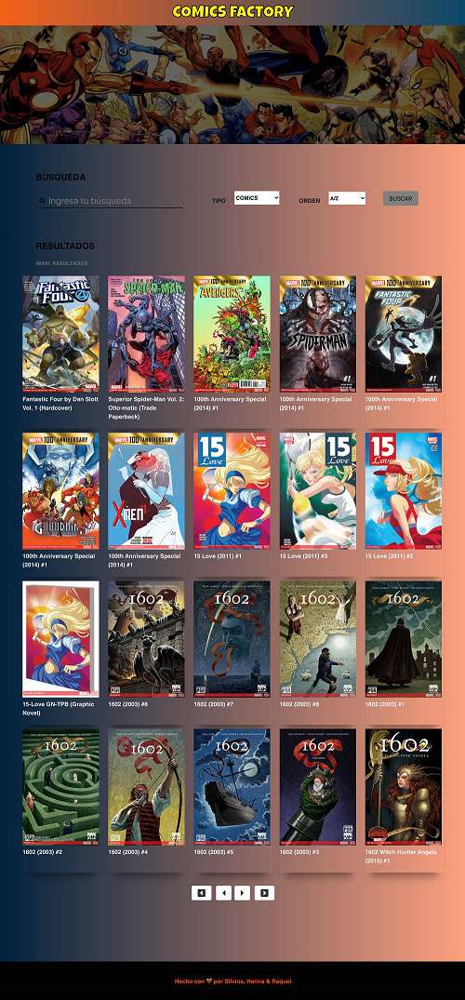

# Proyecto: Buscador de cómics!

### Este proyecto fue realizado utilizando la API de Marvel Cómics. Donde podés visualizar tu comic preferido y los personajes que son parte del mismo. Además, realizar búsquedas mediante tipo y orden.
<br>

### Podés observar como quedó dándole click a este [enlace](https://reymga.github.io/Buscador_comics/)

<br>

***

Si querés tener el código en tu computadora, deberás seguir estos pasos en tu terminal:

- Ir al [repositorio](https://github.com/ReyMga/Buscador_comics)  
- Darle click al botón de forkear
- Darle click al botón de code
- Abrir tu terminal y poner el comando de ```git clone <url>```
- Entrar a la carpeta del proyecto y abrirlo en tu IDE

<br>


## Acá verás como debería verse:
<br> 



<br> 

***

### Realizado con ❤️ por [Raquel](https://github.com/ReyMga), [Hanna](https://github.com/carabolanteh) y [Silvina](https://github.com/Silvi-sanchez).